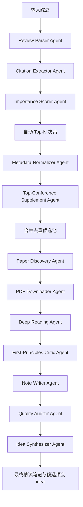

# 论文自动阅读系统搭建方案

## 1. 目标

在当前文件夹内搭建一个“从综述到重要论文精读”的半自动/自动工作流：

1. 输入若干篇论文综述（PDF、DOI、arXiv、HTML 或本地文本）。
2. 解析综述结构、章节主题、引用列表与文内引用位置。
3. 根据综述结构和被引论文网络判断哪些论文更重要。
4. 从网络检索论文元数据和可合法获取的 PDF。
5. 将论文 PDF 下载到本地，并保存检索证据。
6. 对每篇下载论文做精读。
7. 每篇论文生成一个 Markdown 精读笔记。

默认所有 subagent 使用 `gpt-5.5` + `medium` reasoning。

## 2. 设计原则

- 可追溯：每个重要性判断都要能回到综述章节、引用句、元数据或网络检索来源。
- 可中断：下载失败、PDF 缺失、引用解析失败时，不阻塞整个批次，而是写入待处理队列。
- 可复核：重要论文排序不能只看引用次数，要结合综述中的叙事位置、跨综述重复出现、方法/数据/基准地位和领域阶段。
- 合法下载：优先使用 arXiv、OpenAlex、Semantic Scholar、Crossref、Unpaywall、publisher open access、作者主页、机构仓库等公开渠道；遇到付费墙只记录元数据和链接，不绕过访问限制。
- 一篇一档：每篇精读论文只对应一个 `.md` 笔记，文件名稳定，便于 Zotero/Obsidian/本地检索。
- 第一性原理：精读不是摘要搬运，而要追问论文解决的根本问题、基本假设、不可替代贡献、失败边界和可被推翻的条件。
- Idea 导向：论文选择和讲解都服务于发现可投 NeurIPS/ICML/ICLR 的研究 idea，而不是只做文献摘要或泛泛综述。

## 3. 建议目录结构

```text
survey-overall-reading/
  paper_reading_system_plan.md
  config/
    project.yaml
    review_inputs.yaml
    schemas/
      paper_id.schema.json
      evidence_packet.schema.json
      candidate.schema.json
      download_record.schema.json
      reading_note.schema.json
      idea.schema.json
    agent_prompts/
      01_review_parser.md
      02_citation_extractor.md
      03_importance_scorer.md
      04_metadata_normalizer.md
      05_top_conference_supplement.md
      06_paper_discovery.md
      07_pdf_downloader.md
      08_deep_reader.md
      09_first_principles_critic.md
      10_note_writer.md
      11_quality_auditor.md
      12_idea_synthesizer.md
      13_orchestrator.md
  inputs/
    reviews/
      pdf/
      metadata/
  workspace/
    extracted_reviews/
    citation_graph/
    candidate_papers/
    top_conference_search/
    download_queue/
    cache/
      metadata/
      search_results/
      pdf_head_checks/
    rate_limit/
    state/
      papers.sqlite
      workflow_events.jsonl
    logs/
  papers/
    pdf/
    metadata/
  notes/
    deep_reading/
    index.md
  reports/
    review_analysis.md
    important_papers_ranked.md
    missing_papers.md
    compliance_and_version_audit.md
    retrieval_coverage_report.md
    idea_novelty_audit.md
    top_conference_ideas.md
    run_summary.md
```

## 3.1 执行架构

推荐设计不是让 13 个 agent 自由对话，而是使用“状态机 + schema + 队列”的执行架构：

```text
Orchestrator
  -> 读取 config/project.yaml
  -> 创建任务 DAG
  -> 给每个 subagent 分配只读输入和只写输出
  -> 每个输出先过 schema 校验
  -> 校验通过后更新 state database
  -> 失败则记录 workflow_events.jsonl 并进入重试/降级队列
```

每篇论文的状态：

```text
discovered
  -> evidence_extracted
  -> scored
  -> normalized
  -> source_checked
  -> pdf_queued
  -> downloaded_or_link_only
  -> version_verified
  -> reading_assigned
  -> note_written
  -> audited
  -> idea_linked
```

这样保留自动化，不设人工 checkpoint，但每一步都有机器可读的状态、错误原因和可复核证据。

## 4. Subagent 分工

### 4.1 Review Parser Agent

职责：

- 读取输入综述。
- 提取标题、作者、年份、摘要、章节结构、图表标题、研究问题、分类体系。
- 判断综述的组织方式：按时间线、方法流派、任务类型、应用场景、数据集/benchmark、理论框架等。

输出：

- `workspace/extracted_reviews/{review_id}.md`
- `workspace/extracted_reviews/{review_id}.json`

### 4.2 Citation Extractor Agent

职责：

- 提取参考文献列表。
- 对齐文内引用和 bibliography 条目。
- 保存每篇被引论文出现在哪些章节、上下文句子、图表说明或综述分类中。

输出：

- `workspace/citation_graph/references.jsonl`
- `workspace/citation_graph/in_text_citations.jsonl`
- `workspace/citation_graph/citation_contexts.md`

### 4.3 Importance Scorer Agent

职责：

- 根据综述结构和引用上下文给每篇候选论文打分。
- 区分“高被引但背景性论文”和“真正支撑领域路线的关键论文”。
- 生成带数量约束的候选精读清单。
- 识别具有明显演化逻辑的论文链条，并将链条作为整体纳入下载/精读范围。
- 以“能否产生顶会 idea”为额外目标，优先保留能暴露 gap、未解矛盾、范式转折和可迁移机制的论文。

初始评分维度：

| 维度 | 含义 |
|---|---|
| Cross-review recurrence | 是否在多篇综述中重复出现 |
| Structural centrality | 是否出现在核心章节、方法分类标题、综述主线节点 |
| Citation context strength | 文内引用是背景、定义、关键方法、SOTA、数据集、争议还是未来方向 |
| Foundational role | 是否提出基本问题、开创方法、定义任务或建立 benchmark |
| Empirical influence | 是否成为后续比较对象、复现实验基线或数据来源 |
| Recency leverage | 新论文是否代表方向转折，而不是简单增量 |
| Controversy / limitation value | 是否被综述用来说明缺陷、争议或开放问题 |
| Idea generation value | 是否能导出 NeurIPS/ICML/ICLR 级别的问题、方法或实验切入点 |

输出：

- `reports/important_papers_ranked.md`
- `workspace/candidate_papers/candidates.jsonl`

### 4.4 Metadata Normalizer Agent

职责：

- 统一论文标题、作者、年份、venue、DOI、arXiv ID、BibTeX、PDF URL、综述内引用 key。
- 合并同一工作的不同版本，例如 arXiv 预印本、conference 版本、journal extension。
- 为每篇论文生成稳定 `paper_id`，避免下载和笔记阶段重复。
- 只负责“论文身份”和“版本关系”，不负责检索新来源、不负责决定下载哪个 PDF。

输出：

- `papers/metadata/{paper_id}.json`
- `workspace/candidate_papers/deduplicated_candidates.jsonl`

### 4.5 Top-Conference Supplement Agent

职责：

- 在综述筛出的候选论文之外，从 NeurIPS/ICML/ICLR/AAAI 等顶级 AI 会议中补充检索同领域相关论文。
- 使用综述解析出的关键词、taxonomy、演化链主题、未解决 bottleneck、benchmark 名称、方法名、数据集名构造查询。
- 只检索近两年顶会论文。
- 将顶会补充论文与综述引用论文去重合并，标记来源为 `top_conference_supplement`，但顶会补充论文数量与综述内选论文数量彼此独立。
- 为每篇补充论文计算 topic relevance、idea_generation_score 和与已有演化链的连接关系。
- 使用检索上限控制吞吐：元数据候选可多收，进入下载/精读队列需要通过相关性分层和批次上限。

优先来源：

1. NeurIPS 官方 proceedings：`papers.nips.cc`
2. ICML 官方 PMLR proceedings：`proceedings.mlr.press`
3. ICLR OpenReview：`openreview.net/group?id=ICLR.cc/...`
4. AAAI OJS proceedings：`ojs.aaai.org`
5. DBLP：跨会议/年份索引与去重辅助
6. OpenAlex / Semantic Scholar：元数据、引用数、相似论文和 PDF 链接辅助

输出：

- `workspace/top_conference_search/query_plan.md`
- `workspace/top_conference_search/top_conference_candidates.jsonl`
- `workspace/top_conference_search/top_conference_search_report.md`

### 4.6 Paper Discovery Agent

职责：

- 根据标题、作者、年份、DOI、arXiv ID 等检索候选论文。
- 读取 Metadata Normalizer 的稳定 `paper_id`，查找可用页面、PDF URL、OA 状态、引用指标和相似论文。
- 判断最可信 PDF 来源。
- 不改写 `paper_id` 和版本归一化结论；发现冲突时写入 `version_conflict` 供 QA 审计。

优先检索源：

1. DOI / Crossref
2. arXiv
3. OpenAlex / Semantic Scholar
4. Unpaywall / PubMed Central（如果适用）
5. 出版社 OA 页面
6. 作者主页、实验室主页、机构仓库

输出：

- `papers/metadata/{paper_id}.json`
- `workspace/download_queue/download_queue.jsonl`

### 4.7 PDF Downloader Agent

职责：

- 下载公开可访问 PDF。
- 校验文件是否真的是 PDF、是否完整、是否与目标论文匹配。
- 下载失败时写明原因：无 OA、链接失效、疑似错误论文、需要后续复核等。
- 记录来源类型、license/free status、访问日期、版本匹配证据；不绕过登录、付费墙或访问限制。

输出：

- `papers/pdf/{paper_id}.pdf`
- `reports/missing_papers.md`
- `workspace/download_queue/download_records.jsonl`

### 4.8 Deep Reading Agent

职责：

- 对单篇论文做结构化精读。
- 提取问题、假设、方法、实验、结果、限制、与综述主题的关系。
- 明确“为什么这篇论文重要”而不是只复述内容。
- 只生成结构化阅读草稿，不负责最终 Markdown 排版，不负责改写重要性分数。

输出：

- 供 Note Writer Agent 使用的结构化阅读草稿。

### 4.9 First-Principles Critic Agent

职责：

- 专门检查精读草稿是否只是摘要。
- 追问根本问题、最小不可约假设、因果机制、必要性、可证伪点和迁移边界。
- 标记“看似合理但缺少原文证据”的判断。
- 只追加批判性意见和返工问题，不直接重写阅读草稿。

输出：

- 精读草稿的批判性补充意见。
- 需要 Deep Reading Agent 返工的问题清单。

### 4.10 Note Writer Agent

职责：

- 基于精读草稿写入最终 Markdown。
- 一篇论文一个文件。
- 模板参考 `cheneternity/Zotero-Analytical-Workflow-Skills` 中的 `templates/论文精读模板.md`，并加入第一性原理模块。
- 只负责格式化、链接、证据索引和落盘；不新增无来源判断。

输出：

- `notes/deep_reading/{paper_id}__{short_title}.md`

### 4.11 Quality Auditor Agent

职责：

- 检查精读笔记是否有幻觉、无来源判断、模板缺项、文件名重复、PDF/元数据不一致。
- 检查重要性排序是否过度依赖 citation count。
- 检查 schema、状态机、下载合规、版本匹配、检索覆盖率和低置信度项。
- 给出需要后续复核的清单，但不中断主流程。

输出：

- `reports/run_summary.md`
- `reports/qa_findings.md`

### 4.12 Idea Synthesizer Agent

职责：

- 汇总全部精读笔记、演化链和综述未来方向。
- 生成 10-20 个面向 NeurIPS/ICML/ICLR 的候选 research idea。
- 每个 idea 必须包含问题表述、关键假设、方法草图、最小实验、baseline、风险和与已有工作的差异。
- 将 idea 分为高风险高收益、稳健增量、benchmark/evaluation、theory/analysis、system/efficiency 等类型。

输出：

- `reports/top_conference_ideas.md`

### 4.13 Orchestrator Agent

职责：

- 管理队列、状态、失败重试和断点续跑。
- 分配每个阶段的 subagent 任务。
- 不直接做重要性判断或论文精读，避免调度者污染判断。
- 自动推进完整流程：综述解析、重要性排序、论文检索、PDF 下载、精读、写笔记、QA。
- 在综述内重要论文确定后，自动触发顶会补充检索，并将补充论文纳入下载与精读队列。
- 控制搜索、元数据查询和 PDF 下载的并发与速率，在速度和限流风险之间动态平衡。
- 对低置信度项目自动标记 `needs_later_review: true`，但不中断主流程。

输出：

- `workspace/logs/orchestrator_state.json`
- `reports/run_summary.md`

### 4.14 职责重叠与边界修正

审阅后确认有三组容易重叠的职责，后续实现按以下边界处理：

| 易重叠 agent | 风险 | 修正边界 |
|---|---|---|
| Metadata Normalizer vs Paper Discovery | 都可能做元数据归一、去重、版本合并 | Metadata Normalizer 只产稳定 `paper_id` 和版本关系；Paper Discovery 只找来源、PDF URL、OA 状态和引用指标 |
| Deep Reading vs First-Principles Critic vs Note Writer | 都可能重写论文理解内容 | Deep Reading 产结构化草稿；Critic 只追加批判问题和第一性原理检查；Note Writer 只格式化落盘，不新增无来源判断 |
| Quality Auditor vs Idea Synthesizer | 都可能评价论文和 idea | Quality Auditor 审计事实、schema、合规、版本、幻觉；Idea Synthesizer 只在通过审计的材料上生成和筛选 research idea |

Orchestrator 只调度和更新状态，不直接修改任何学术判断。

## 5. 数据流



## 6. 重要论文排序策略

初始版本不直接使用单一排序，而使用“证据抽取 -> 引用意图分类 -> 演化链识别 -> 多维打分 -> 数量约束选择 -> 偏差校正 -> 自动分层”的七步判断。

### 6.1 候选召回

一篇论文进入候选池的条件：

- 被至少一篇综述引用。
- 出现在综述核心章节，而非只在背景段落出现。
- 被综述描述为 seminal、foundational、benchmark、representative、state-of-the-art、surveyed method、taxonomy node、challenge source 等角色。
- 或者虽然引用次数不高，但出现在“未来方向/挑战/局限”相关段落中。

### 6.2 证据抽取

每篇候选论文必须生成一个 evidence packet：

```yaml
paper_id:
  title:
  normalized_versions:
  cited_by_reviews:
    - review_id:
      sections:
      citation_contexts:
      local_role_labels:
      pages_or_anchors:
  external_metadata:
    citation_count:
    venue:
    year:
    doi:
    arxiv:
    influential_citation_count:
  scoring:
    raw_scores:
    adjusted_score:
    tier:
    confidence:
    needs_later_review:
```

其中最关键的是 `citation_contexts`，也就是综述到底在什么语境下引用这篇论文。

### 6.3 引用意图分类

Citation Extractor Agent 需要把每次文内引用分类。不同引用意图的权重不同：

| 引用意图 | 判断线索 | 权重倾向 |
|---|---|---|
| Foundational / seminal | introduced, first proposed, seminal, pioneering, established | 很高 |
| Method representative | representative, typical, widely used, categorized under a method family | 高 |
| Benchmark / dataset / metric | dataset, benchmark, evaluation protocol, metric, baseline | 高 |
| State-of-the-art / recent advance | achieves SOTA, recent progress, improves over | 中高 |
| Taxonomy node | 作为综述分类体系中的一个节点或路线代表 | 很高 |
| Bridge paper | 连接两个方向、引出新范式或改变问题定义 | 很高 |
| Limitation / controversy | 被用来说明失败边界、争议、开放问题 | 中高 |
| Background citation | 泛泛介绍背景、常识或领域历史 | 低 |
| Tool / implementation | 工具、库、平台，除非是领域基础设施 | 中低 |
| Incidental citation | 一串引用中的顺带列举，无具体讨论 | 很低 |

### 6.4 重要性打分

建议初始使用两个分数，而不是把所有目标混成一个分数：

```text
importance_score =
  0.25 * cross_review_recurrence
  0.20 * structural_centrality
  0.20 * citation_context_strength
  0.15 * foundational_or_benchmark_role
  0.10 * empirical_influence
  0.05 * recency_leverage
  0.05 * limitation_or_controversy_value

idea_generation_score =
  0.25 * unresolved_bottleneck_signal
  0.20 * evolution_chain_position
  0.15 * frontier_relevance
  0.15 * methodological_transferability
  0.10 * benchmark_or_metric_shift
  0.10 * feasibility_of_minimal_experiment
  0.05 * reviewer_interest_risk_balance
```

`importance_score` 决定这篇论文是否值得读，`idea_generation_score` 决定它对 NeurIPS/ICML/ICLR 选题发现的价值。最终选择使用二者组合，而不是让 idea 潜力挤掉必要的奠基论文。

所有子分数先归一化到 0-1，再进入公式。生成分数时，agent 不能凭印象打分，必须从 evidence packet 中读取可观测证据。

#### 6.4.1 importance_score 的生成

| 维度 | 自动判断方法 | 归一化规则 |
|---|---|---|
| cross_review_recurrence | 出现在几篇综述中；按综述质量和主题相关性加权 | `min(1, weighted_review_count / total_review_clusters)`；同领域多综述共现加权更高 |
| structural_centrality | 是否出现在标题、小节开头、taxonomy 表格、路线图、核心图、总结表 | 按位置累计：标题/小节名 1.0，taxonomy/表格 0.9，段首重点讨论 0.7，普通正文 0.4，参考文献列表但正文弱提及 0.1 |
| citation_context_strength | 按引用意图分类累加，避免“一串引用”虚高 | foundational/bridge/taxonomy 1.0，benchmark 0.85，method representative 0.75，SOTA 0.65，limitation 0.6，tool 0.35，background 0.2，incidental 0.05；取多次引用的加权最大值与均值组合 |
| foundational_or_benchmark_role | 是否提出任务/方法范式/数据集/评价协议 | 明确提出任务/范式/benchmark 为 1.0；标准 baseline 为 0.7；只使用现有数据/指标为 0.3 |
| empirical_influence | 是否被多篇后续论文作为 baseline、benchmark 或 comparison target | 由外部 citation count、influential citation count、综述中的 baseline 语境共同归一化；使用年份归一化，避免老论文天然占优 |
| recency_leverage | 新论文是否代表方向转折，而不是只因年份新获得加分 | 近 3 年且被综述标为新趋势/范式转折为 1.0；只是新但语境弱不超过 0.3 |
| limitation_or_controversy_value | 是否帮助理解领域边界、失败原因或研究空白 | 被用于 failure、challenge、open problem、negative finding、controversy 语境时加分；普通缺点描述不超过 0.4 |

#### 6.4.2 idea_generation_score 的生成

| 维度 | 自动判断方法 | 归一化规则 |
|---|---|---|
| unresolved_bottleneck_signal | 多篇论文或综述反复提到同一失败点、成本、泛化、数据、评价问题 | 跨论文/跨综述重复出现且仍未解决为 1.0；单篇提及为 0.4-0.6 |
| evolution_chain_position | 是否位于“问题 -> 方法 -> 局限 -> 改进 -> 新范式”链条的关键转折点 | paradigm shift / bottleneck exposing paper 为 1.0；普通增量节点为 0.4 |
| frontier_relevance | 是否与近年 NeurIPS/ICML/ICLR 热点、近期 arXiv/顶会趋势、综述未来方向重叠 | 综述未来方向和近期趋势同时命中为 1.0；只命中一边为 0.5 |
| methodological_transferability | 方法或问题能否迁移到其他任务、模态、数据规模或训练范式 | 明显可迁移且有未验证场景为 0.8-1.0；强领域绑定为 0.2-0.4 |
| benchmark_or_metric_shift | 是否暴露评价指标、数据集、benchmark 的不足或变化 | 可形成新 benchmark/evaluation paper 为 1.0；只是换数据集为 0.3 |
| feasibility_of_minimal_experiment | 是否能设计出低成本但有说服力的最小验证实验 | 有明确 baseline、公开数据、可实现方法为 1.0；依赖昂贵资源或私有数据则降权 |
| reviewer_interest_risk_balance | idea 是否有顶会审稿兴趣，同时避免过窄、过工程或纯调参 | 高新颖性且有清晰证据路径为 1.0；高风险但证据弱为 0.4-0.6 |

最终排序：

```text
selection_score =
  0.65 * importance_score
  + 0.35 * idea_generation_score
  + evolution_chain_bonus
  + topic_relevance_bonus
```

其中 `evolution_chain_bonus` 用来保护有连续演化逻辑的中间论文，避免它们被单点代表作挤掉。

分数输出必须包含解释：

```yaml
scoring_trace:
  importance_score:
    value:
    evidence:
      - dimension:
        score:
        source_review:
        quote_or_anchor:
        reason:
  idea_generation_score:
    value:
    evidence:
      - dimension:
        score:
        source_review:
        quote_or_anchor:
        reason:
  selection_score:
    value:
    bonuses:
      evolution_chain_bonus:
      topic_relevance_bonus:
```

### 6.5 演化链识别

对于有明显演化逻辑的方向，不采用“只选代表论文”的抽样策略，而是识别并保留整条关键链路。典型演化链包括：

- Problem formulation chain：问题定义如何变化，例如从分类到生成、从监督到自监督、从静态到交互式。
- Architecture chain：模型结构如何演化，例如 CNN -> Transformer -> diffusion / agentic / retrieval-augmented variants。
- Objective / training chain：损失函数、训练范式、数据构造或反馈机制如何演化。
- Benchmark chain：数据集、评测协议和指标如何推动方法变化。
- Scaling chain：规模、数据、计算、推理时预算如何改变方法边界。
- Failure-to-fix chain：某篇论文暴露缺陷，后续论文逐步修补或绕开。
- Cross-domain transfer chain：一个领域的方法如何迁移到另一个任务或模态。

链条保留规则：

```text
如果一组论文构成“问题 -> 代表方法 -> 局限 -> 改进 -> 新范式/新 benchmark”的连续逻辑，
则整条链优先下载和精读；
不要只选其中 citation count 最高或综述篇幅最长的一篇。
```

每条链输出：

```yaml
evolution_chain:
  chain_id:
  theme:
  papers:
    - paper_id:
      role: problem_definition | seminal_method | benchmark | limitation | improvement | paradigm_shift | frontier
      predecessor:
      successor:
      why_needed_for_idea_generation:
  possible_top_conference_angles:
    - unresolved_bottleneck:
      potential_method_direction:
      evaluation_path:
```

### 6.6 数量约束选择

系统必须同时满足“质量优先”和“最低数量限制”。用户给出的 50/90/120 是至少选择这么多篇，不是上限。

先判断输入综述是否属于明显相同领域：

- 相同领域：综述标题/摘要/关键词高度重叠，核心术语相同，引用列表 Jaccard overlap 较高，核心方法族相似。
- 不同领域：主题簇明显分裂，引用列表重叠低，核心术语和方法族不同。

相同领域时，默认最低数量如下：

| 综述数量 | 默认选择数量 | 说明 |
|---|---:|---|
| 1 篇综述 | 至少 50 篇论文 | 适合完整覆盖主线、代表方法、benchmark、关键前沿 |
| 2 篇综述 | 至少 90 篇论文 | 两篇综述通常有重叠，去重后保留更宽的演化链 |
| 3 篇综述 | 至少 120 篇论文 | 增量放缓，避免边缘论文淹没核心主线 |
| 4 篇及以上 | 至少 `120 + 20 * (n - 3)` | 多综述用于提高召回和交叉验证，不线性扩大精读量 |

最终选择数量：

```text
same_field_target_count =
  max(minimum_count_by_review_count, ceil(0.20 * deduplicated_candidate_count))
```

如果 Top 20% 超过最低数量，则使用 Top 20% 的数量。

不同领域时，不能把所有综述混成一个总榜单，应先按主题聚类，然后对每个领域簇分别选择：

```text
cluster_target_count =
  max(cluster_minimum_count, ceil(cluster_top_percent * cluster_candidate_count))

cluster_top_percent 默认 0.20；
如果领域簇之间引用重叠很低或研究问题明显不同，可放宽到 0.25-0.35；
如果某个领域簇包含完整演化链，可继续超额保留链条论文。
```

默认选择策略：

```text
selected_papers =
  all(Must-read)
  + all(core_evolution_chain_papers)
  + top(Route-representative, by method family coverage)
  + top(Watch/frontier, by idea_generation_value)
  + necessary(Context/background, only if needed to understand a chain)

直到达到 target_paper_count。
如果 Must-read + core_evolution_chain_papers 超过 target_paper_count，
则允许超过默认数量，但必须在报告中解释超额原因。
```

配额分配建议：

| 类型 | 默认比例 | 作用 |
|---|---:|---|
| Must-read / foundational | 25% | 建立问题和范式底座 |
| Evolution-chain papers | 35% | 保留技术演化逻辑，支撑 idea 生成 |
| Route-representative | 20% | 覆盖不同方法族 |
| Watch / frontier | 15% | 捕捉顶会潜在新方向 |
| Context / background | 5% | 只补必要背景 |

### 6.7 偏差校正

为了避免排序被带偏，Importance Scorer Agent 必须做这些校正：

- citation count 只能作为辅助项，不能单独决定 Top-N。
- 同一工作的 arXiv/conference/journal extension 合并后只算一次。
- 背景段落中的高被引论文降权。
- 核心章节中被详细讨论的低引用新论文保留机会。
- 数据集、benchmark、metric 论文单独标记，不和方法论文粗暴比较。
- 综述作者偏好明显时，用多篇综述共现和外部元数据抵消单篇综述偏差。
- 年份归一化：老论文看长期影响，新论文看是否触发新路线。
- 演化链中的“中间论文”不能因为 citation count 较低被自动丢弃；如果它解释了范式变化，必须保留。
- 面向顶会 idea 的选择要避免只读 SOTA 论文，也要读失败、限制、负结果、benchmark shift 和被后来论文修正的工作。

### 6.8 自动分层

系统不只输出单一榜单，而是自动分成四类：

| 层级 | 含义 | 后续动作 |
|---|---|---|
| Must-read | 对理解综述主题不可替代 | 下载并完整精读 |
| Evolution-chain | 构成清晰技术演化链的论文 | 整条链下载并精读，重点读前后继关系 |
| Route-representative | 某条技术路线的代表论文 | 下载并精读，重点读方法和影响 |
| Context / background | 有助于补背景，但不是主线核心 | 下载可选，生成轻量笔记 |
| Watch / frontier | 新趋势或争议点，证据未完全沉淀 | 下载并做“趋势/风险”型笔记 |

如果用户要求“完成所有步骤”，系统默认自动选择：

```text
Must-read 全部进入精读；
Evolution-chain 整条关键链进入精读；
Route-representative 在满足链条覆盖后按方法族补齐；
Watch / frontier 同时受 Top 20%、最小数量和总配额约束；
Context / background 只在数量不足或与核心概念强相关时进入精读。
```

### 6.9 面向顶会 idea 的选择加权

因为系统目标是从所选论文中产生可用于 NeurIPS/ICML/ICLR 投稿的 idea，所以 Importance Scorer Agent 还要额外计算 `idea_generation_value`：

| 信号 | 为什么有利于产生 idea |
|---|---|
| 多篇论文反复绕不开同一瓶颈 | 可能存在未解决核心问题 |
| benchmark 或评价指标发生变化 | 可能出现新任务定义或新评测贡献 |
| 方法性能提升但机制解释薄弱 | 可做理论、诊断或机制性工作 |
| 方法有效但成本过高 | 可做 cheaper / faster / smaller 方向 |
| 依赖强假设或人工标注 | 可做 weaker supervision / robustness / automation |
| 只在窄场景验证 | 可做 broader generalization / transfer |
| 新论文修补旧论文失败点 | 可沿 failure-to-fix chain 找下一步 |
| 综述未来方向与近期 frontier 重叠 | 顶会 relevance 更强 |

最终精读笔记必须额外输出：

```markdown
## 11. 顶会 Idea 提炼

- 这篇论文暴露的核心 gap:
- 可投稿 NeurIPS/ICML/ICLR 的问题表述:
- 可能的方法切入:
- 最小可行实验:
- 需要对比的 baselines:
- 风险与拒稿点:
- 与已读演化链的关系:
```

### 6.10 置信度

每篇论文除了重要性分数，还必须给出置信度：

- High：多篇综述共现，引用语境强，元数据匹配清楚。
- Medium：综述内部证据强，但外部元数据或版本归一化仍有不确定。
- Low：标题/作者/版本匹配不稳，或只来自单一综述且语境模糊。

低置信度项目仍可继续下载和精读，但最终笔记和报告必须标记 `needs_later_review: true`。

### 6.11 顶会补充检索策略

综述引用列表只能覆盖综述写作前已经进入作者视野的论文。为了发现更适合 NeurIPS/ICML/ICLR/AAAI 等顶级 AI 会议投稿的 research idea，系统需要在综述筛选后增加一轮顶会补充检索。

#### 6.11.1 论文列表来源

优先使用这些来源获取 accepted / proceedings 论文列表：

| 会议 | 首选来源 | 作用 |
|---|---|---|
| NeurIPS | `papers.nips.cc` | 官方 proceedings，含历年论文页面与 PDF |
| ICML | `proceedings.mlr.press` | PMLR 官方 proceedings，含 ICML 论文元数据和 PDF |
| ICLR | `openreview.net` | 官方 OpenReview 页面，含 accepted submissions、reviews、PDF |
| AAAI | `ojs.aaai.org` | AAAI proceedings / OJS 论文页面 |
| 其他 AI 顶会 | ACL Anthology、CVF Open Access、ACM DL、IEEE Xplore、PMLR、OpenReview | 视领域扩展，例如 ACL/EMNLP/CVPR/ICCV/ECCV/KDD/UAI/AISTATS/COLT |
| 跨会议索引 | DBLP、OpenAlex、Semantic Scholar | 补全年份、venue、引用数、去重和相似论文 |

#### 6.11.2 查询构造

Top-Conference Supplement Agent 不直接用宽泛关键词搜索，而是从综述阶段生成查询：

```text
query_terms =
  core_problem_terms
  + method_family_terms
  + benchmark_dataset_metric_terms
  + bottleneck_terms
  + evolution_chain_terms
  + future_direction_terms
```

每个查询都带目标 venue/year filter：

```yaml
top_conference_query:
  theme:
  query_terms:
  target_venues: [NeurIPS, ICML, ICLR, AAAI]
  year_range: recent_2_years
  metadata_candidate_limit_per_venue_year: 100
  reading_queue_limit_per_cluster: 60
  source_priority:
    - official_proceedings
    - openreview_or_pmlr
    - dblp
    - openalex_semantic_scholar
```

#### 6.11.3 补充论文选择

顶会补充论文进入候选池需要满足至少一项：

- 与综述核心主题、方法族、benchmark 或 bottleneck 高相关。
- 与已识别演化链存在前驱/后继/修补/替代关系。
- 直接命中综述 future direction 或 open problem。
- 来自近两年 NeurIPS/ICML/ICLR/AAAI，并且 topic relevance 与 idea_generation_score 较高。
- 虽未被综述引用，但被顶会论文列表显示为该方向的新进展。

补充论文不会因为“没有出现在综述引用列表”被降权；相反，它们的主要价值是补足综述滞后性。最终报告必须区分：

```yaml
candidate_source:
  - review_citation
  - top_conference_supplement
  - both
```

#### 6.11.4 独立补充队列规则

顶会补充检索与综述内选论文数量彼此独立：

```text
review_selected_papers 使用 6.6 的最低数量 / Top 20% / 演化链规则；
top_conference_supplement_papers 单独从近两年顶会列表检索；
两者合并去重后进入下载和精读队列。
```

顶会补充检索与综述内选论文数量独立，但需要设置检索上限，避免顶会召回爆量拖垮下载和精读：

```text
venue in target_venues
year in recent_2_years
topic_relevance >= threshold
not_duplicate_after_metadata_normalization
```

进入补充候选池。随后按两层上限进入后续队列：

```text
metadata_candidate_limit_per_venue_year = 100
reading_queue_limit_per_cluster = 60
```

如果某个领域簇内超过上限，则按 `selection_score` 和 `idea_generation_score` 分层：

```text
Tier A: topic_relevance >= 0.80 且 idea_generation_score 高，优先下载和精读
Tier B: topic_relevance 0.60-0.80，下载/精读按空闲资源分批处理
Tier C: topic_relevance < 0.60，只记录元数据，不进入精读队列
```

如果多个综述领域明显不同，则对每个领域簇分别进行近两年顶会补充检索。

### 6.12 合法下载与版本匹配

PDF 下载前必须生成 `download_record`，记录来源与合规状态：

```yaml
download_record:
  paper_id:
  source_url:
  source_type: arxiv | publisher_oa | pmlr | openreview | proceedings | author_homepage | institutional_repository | unknown
  access_status: open_access | free_to_read | preprint | accepted_manuscript | metadata_only | blocked
  license:
  access_date:
  can_download: true | false
  can_text_mine: true | false | unknown
  version_match:
    title_match:
    author_match:
    year_match:
    venue_match:
    doi_or_arxiv_match:
    confidence:
  action: download_pdf | save_link_only | skip
  reason:
```

下载规则：

- arXiv、OpenReview、PMLR、NeurIPS proceedings、AAAI proceedings 等公开论文页面优先。
- publisher OA 可以下载；publisher free-to-read 但 license 不明时记录来源和访问日期。
- 作者主页/机构仓库只在主来源缺失时使用，并记录版本类型。
- 付费墙、登录后访问、机构订阅内容不自动下载，只保存元数据和链接。
- 若 PDF 标题/作者/年份/DOI 与目标论文冲突，则不进入精读，写入 `version_conflict`。

### 6.13 Idea 查重与反证检索

Idea Synthesizer Agent 生成候选 idea 后，必须自动做 novelty audit，而不是直接输出“看起来合理”的 idea。

每个 idea 需要反查：

- 近两年 NeurIPS/ICML/ICLR/AAAI 相关论文。
- OpenReview / arXiv / Semantic Scholar / OpenAlex 中相似标题、相似摘要、相似方法关键词。
- 已读论文中的后续工作、limitations、future work。
- 关键 baseline 是否已有同类改进。

输出格式：

```yaml
idea_audit:
  idea_id:
  claim:
  nearest_existing_works:
    - paper_id:
      overlap:
      why_not_same:
      risk_level:
  novelty_status: likely_new | partially_overlapping | likely_already_done | insufficient_evidence
  feasibility:
    required_data:
    required_compute:
    minimal_experiment:
    baselines:
  rejection_risks:
    - novelty
    - significance
    - experimental_weakness
    - unclear_problem
  decision: keep | revise | drop
```

只有 `keep` 和 `revise` 的 idea 进入 `reports/top_conference_ideas.md`；`drop` 写入 `reports/idea_novelty_audit.md` 作为负例记录。

### 6.14 速率限制与吞吐控制

系统需要频繁查询元数据、搜索论文、访问顶会列表、下载 PDF，因此必须同时考虑两个目标：

- 不触发各数据源的 rate limit、封禁或 429。
- 在可接受风险内尽快完成批量处理。

#### 6.14.1 基本策略

```text
先缓存，再查询；
先批量元数据，再逐篇 PDF；
官方/结构化 API 优先，网页抓取低并发；
失败重试使用指数退避，不立即重复请求；
不同数据源独立限速，不让一个源的限流拖垮全局队列。
```

#### 6.14.2 分源限速

每个数据源维护独立 token bucket：

| 来源 | 用途 | 默认并发 | 策略 |
|---|---|---:|---|
| OpenAlex | 元数据、引用数、开放 PDF 链接 | 3-5 | 支持较高吞吐，优先批量和缓存 |
| Crossref | DOI、引用数、出版信息 | 2-3 | 带 mailto，失败后退避 |
| Semantic Scholar | citationCount、influentialCitationCount、相似论文 | 1-3 | 有 API key 时提高并发；无 key 保守 |
| OpenReview | ICLR 论文、PDF、review 信息 | 1-2 | API/页面都保守，避免频繁重复 |
| PMLR | ICML proceedings/PDF | 2-3 | 静态页面可中等并发 |
| papers.nips.cc | NeurIPS proceedings/PDF | 2-3 | 静态页面可中等并发 |
| AAAI OJS | AAAI proceedings/PDF | 1-2 | OJS 保守访问 |
| 作者主页/机构仓库 | PDF 补充来源 | 1 | 只在主来源失败后访问 |

#### 6.14.3 缓存

所有网络结果都写入缓存：

```text
workspace/cache/metadata/{source}/{paper_id}.json
workspace/cache/search_results/{source}/{query_hash}.json
workspace/cache/pdf_head_checks/{url_hash}.json
```

缓存策略：

- DOI/arXiv/venue/year/title 匹配结果长期缓存。
- citation count 缓存 7-30 天即可，因为它会变化。
- PDF URL 的 HEAD/Content-Type/Content-Length 检查缓存 7 天。
- 下载失败原因缓存，避免短时间内反复访问同一坏链接。

#### 6.14.4 队列优先级

为了兼顾速度和价值，下载/查询队列按优先级处理：

1. Must-read + core evolution-chain papers
2. Top-conference supplement with high topic relevance
3. Route-representative papers
4. Watch / frontier papers
5. Context / background papers
6. Low-confidence papers

高优先级论文先查元数据和 PDF，低优先级论文可以在等待限流恢复时处理。

#### 6.14.5 重试和降级

```text
HTTP 429 / 503:
  exponential backoff: 30s -> 2min -> 10min -> source cooldown

timeout:
  retry 2 times with longer timeout

bad PDF:
  try next source, then mark failed

source unavailable:
  switch to alternative source and record failure
```

如果某个来源持续限流，系统不停止，而是降级：

- Semantic Scholar 失败：使用 OpenAlex + Crossref。
- OpenReview 慢：先保存论文列表，PDF 稍后下载。
- PDF 下载慢：先完成元数据和笔记队列准备。
- citation count 缺失：按 missing data 处理，不作为 0 分。

#### 6.14.6 并发控制

系统使用两层并发：

```text
global_network_concurrency: 控制总网络请求数
per_source_concurrency: 控制单个来源请求数
```

默认建议：

```yaml
network:
  global_concurrency: 8
  metadata_concurrency: 5
  pdf_download_concurrency: 3
  per_source_concurrency:
    openalex: 5
    crossref: 3
    semantic_scholar: 2
    openreview: 2
    pmlr: 3
    neurips: 3
    aaai_ojs: 2
    author_homepage: 1
```

如果出现 429，则动态下调该来源并发；如果连续成功且响应稳定，可以逐步恢复。

## 7. 精读笔记模板

每篇论文的 Markdown 建议采用下面结构。基础栏目参考 `Zotero-Analytical-Workflow-Skills` 的论文精读模板，但改造为本项目的自动阅读版本，并增加面向 NeurIPS/ICML/ICLR idea 生成的模块。

```markdown
# {论文标题}

## 1. 基本信息

- Title:
- Authors:
- Year:
- Venue:
- DOI / arXiv:
- PDF:
- Source review(s):
- Importance rank:
- Importance rationale:

## 2. 一句话结论

用 1-2 句话说明这篇论文真正贡献了什么。

## 3. 第一性原理分析

### 3.1 根本问题

这篇论文试图解决的最底层问题是什么？如果去掉领域术语，它在优化什么矛盾？

### 3.2 基本假设

作者默认了哪些前提？这些前提来自数据、任务定义、模型能力、实验环境还是评价指标？

### 3.3 必要性

为什么已有方法不足以解决这个问题？这篇论文的关键设计是否是必要的，还是只是可替代实现？

### 3.4 机制解释

方法为什么应该有效？请按因果链条说明，而不只是复述模块名称。

### 3.5 可证伪点

在哪些条件下，这篇论文的核心主张会失败？需要什么实验或反例来推翻它？

### 3.6 迁移边界

这篇论文的思想能迁移到哪些任务/数据/领域？哪些地方不能迁移？

## 4. 论文结构精读

### 4.1 Introduction

### 4.2 Related Work

### 4.3 Method

### 4.4 Experiments

### 4.5 Discussion / Limitation

## 5. 方法拆解

- 输入:
- 输出:
- 核心模块:
- 训练/推理流程:
- 关键公式:
- 复杂度:

## 6. 实验与证据

- 数据集:
- Baselines:
- Metrics:
- Main results:
- Ablation:
- Failure cases:
- 证据是否支撑主张:

## 7. 与综述主线的关系

- 在综述中出现的位置:
- 被综述赋予的角色:
- 它连接了哪些前后论文:
- 它对领域路线的影响:

## 8. 我的判断

- 重要性:
- 创新性:
- 可靠性:
- 可复现性:
- 值得借鉴的设计:
- 可能被高估的地方:

## 9. 可继续追踪的问题

- 后续应该读哪些论文:
- 有哪些开放问题:
- 可以如何用于自己的研究:

## 10. 原文证据索引

记录关键判断对应的页码、章节、图表或原文短引。

## 11. 顶会 Idea 提炼

- 这篇论文暴露的核心 gap:
- 可投稿 NeurIPS/ICML/ICLR 的问题表述:
- 可能的方法切入:
- 最小可行实验:
- 需要对比的 baselines:
- 风险与拒稿点:
- 与已读演化链的关系:
```

## 8. 初始配置文件设想

`config/project.yaml`:

```yaml
model:
  name: gpt-5.5
  reasoning_effort: medium

reading:
  language: zh-CN
  minimum_papers_by_same_field_review_count:
    1: 50
    2: 90
    3: 120
    additional_review_increment: 20
  same_field_top_percent: 20
  different_field_top_percent_range: [25, 35]
  hard_cap: null
  allow_exceed_target_for_core_evolution_chains: true
  note_template: zotero_analytical_plus_first_principles
  human_checkpoint: false
  low_confidence_action: continue_with_flag
  final_goal: generate_neurips_icml_iclr_ideas

download:
  allow_paywalled_bypass: false
  prefer_open_access: true
  save_failed_items: true

network:
  global_concurrency: 8
  metadata_concurrency: 5
  pdf_download_concurrency: 3
  adaptive_rate_limit: true
  retry:
    max_attempts: 3
    backoff_schedule_seconds: [30, 120, 600]
  per_source_concurrency:
    openalex: 5
    crossref: 3
    semantic_scholar: 2
    openreview: 2
    pmlr: 3
    neurips: 3
    aaai_ojs: 2
    author_homepage: 1

cache:
  enabled: true
  metadata_ttl_days: 30
  citation_count_ttl_days: 7
  pdf_head_check_ttl_days: 7
  failed_download_ttl_days: 3

top_conference_supplement:
  enabled: true
  target_venues:
    - NeurIPS
    - ICML
    - ICLR
    - AAAI
  expandable_venues:
    - ACL
    - EMNLP
    - CVPR
    - ICCV
    - ECCV
    - KDD
    - UAI
    - AISTATS
    - COLT
  official_sources:
    neurips: papers.nips.cc
    icml: proceedings.mlr.press
    iclr: openreview.net
    aaai: ojs.aaai.org
    cross_venue_index: dblp.org
  recent_year_window: 2
  metadata_candidate_limit_per_venue_year: 100
  reading_queue_limit_per_cluster: 60
  selection_rule: tiered_by_relevance_and_idea_value
  min_topic_relevance: 0.60

compliance:
  require_download_record: true
  allow_sources:
    - arxiv
    - publisher_oa
    - pmlr
    - openreview
    - proceedings
    - author_homepage
    - institutional_repository
  blocked_actions:
    - bypass_paywall
    - use_login_required_content
    - download_subscription_pdf
  on_unclear_license: save_link_only
  require_version_match_confidence: 0.80

idea_audit:
  enabled: true
  recent_year_window: 2
  check_sources:
    - NeurIPS
    - ICML
    - ICLR
    - AAAI
    - arxiv
    - semantic_scholar
    - openalex
  final_idea_count_range: [10, 20]
  require_minimal_experiment: true
  drop_if_likely_already_done: true

importance_scoring:
  importance_score_weights:
    cross_review_recurrence: 0.25
    structural_centrality: 0.20
    citation_context_strength: 0.20
    foundational_or_benchmark_role: 0.15
    empirical_influence: 0.10
    recency_leverage: 0.05
    limitation_or_controversy_value: 0.05
  idea_generation_score_weights:
    unresolved_bottleneck_signal: 0.25
    evolution_chain_position: 0.20
    frontier_relevance: 0.15
    methodological_transferability: 0.15
    benchmark_or_metric_shift: 0.10
    feasibility_of_minimal_experiment: 0.10
    reviewer_interest_risk_balance: 0.05
  selection_score_weights:
    importance_score: 0.65
    idea_generation_score: 0.35
  automatic_selection:
    must_read: all
    core_evolution_chains: all
    route_representative_per_route: fill_after_evolution_chains
    watch_frontier_top_percent: 20
    watch_frontier_min_count: 10
    context_background: only_if_core_concept_or_insufficient_count
```

## 9. 当前需要确认的问题

1. 输入综述的形式是什么：本地 PDF、DOI/arXiv 链接、网页，还是你会把综述文件放入 `inputs/reviews/pdf/`？
2. 默认目标已经设为发现可投 NeurIPS/ICML/ICLR 的 research idea；如果你的目标会议或领域不是 ML 顶会，需要调整选择权重。
3. “重要论文”的判定会同时考虑奠基性、方法代表性、benchmark 价值、演化链位置和 idea generation value；如果你有明确课题方向，需要额外加入 topic relevance。
4. 默认最低数量：同领域综述下，1 篇至少 50 篇，2 篇至少 90 篇，3 篇至少 120 篇，4 篇及以上至少 `120 + 20 * (n - 3)`；如果 Top 20% 更多则按 Top 20%，核心演化链允许继续超额，不同领域综述按领域簇放宽比例和数量。
5. 精读笔记语言使用中文、英文，还是中英双语？我建议默认中文，保留英文术语。
6. 精读深度希望到什么程度：1 页速读、3-5 页精读，还是可复现级别分析？
7. 是否允许联网下载 open access PDF？如果网络下载受限，需要你确认是否使用浏览器/命令行联网权限。
8. 是否只允许 open access、arXiv、publisher free PDF、机构仓库等合法公开来源？
9. 是否需要接入 Zotero 本地库，还是先做纯文件夹工作流？
10. 目标领域是什么？不同领域对重要性的判断会不同，例如 ML 系统、医学、材料、生信、社会科学的 citation context 差异很大。
11. 是否要生成一个总览索引 `notes/index.md`，按主题、年份、重要性和研究路线组织全部精读笔记？
12. 是否需要把每篇论文的引用关系导出为 Obsidian 可用的双链或 Mermaid 图？
13. 对 PDF 下载是否有机构代理、校园网、Zotero storage 或已有文献库路径可以使用？
14. 如果不做人工确认，遇到低置信度但可能重要的论文，默认会继续下载和精读，并在最终报告中标记 `needs_later_review: true`。这个策略是否符合你的预期？
15. 默认会额外生成 `reports/top_conference_ideas.md`，汇总从全部精读笔记中提炼出的 10-20 个候选投稿 idea。

## 10. 下一步建议

第一阶段先搭建最小可运行框架：

1. 创建目录结构和配置文件。
2. 写 13 个 subagent prompt。
3. 写一个 `runbook.md`，规定人工如何放入综述、如何启动每个阶段、如何检查输出。
4. 先用 1 篇综述自动试跑，并在报告中输出重要性排序证据链。
5. 再扩大到多篇综述和批量下载/精读。

等以上问题确认后，再进入第二阶段：创建目录、prompt、配置、脚本入口和示例输出。
